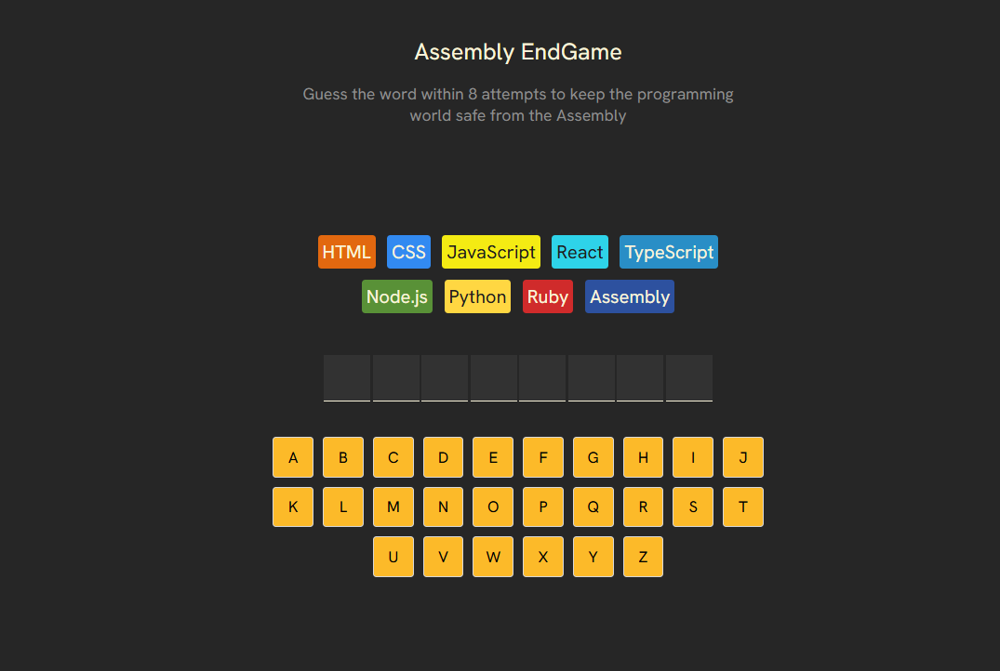
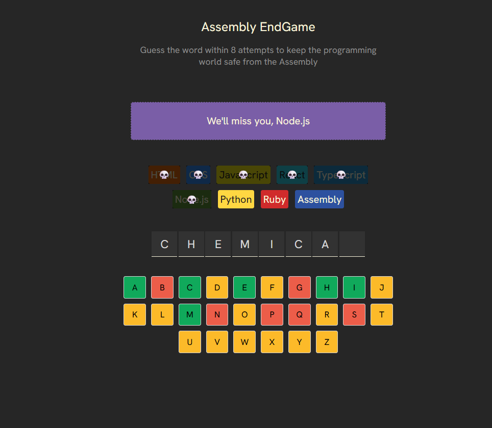
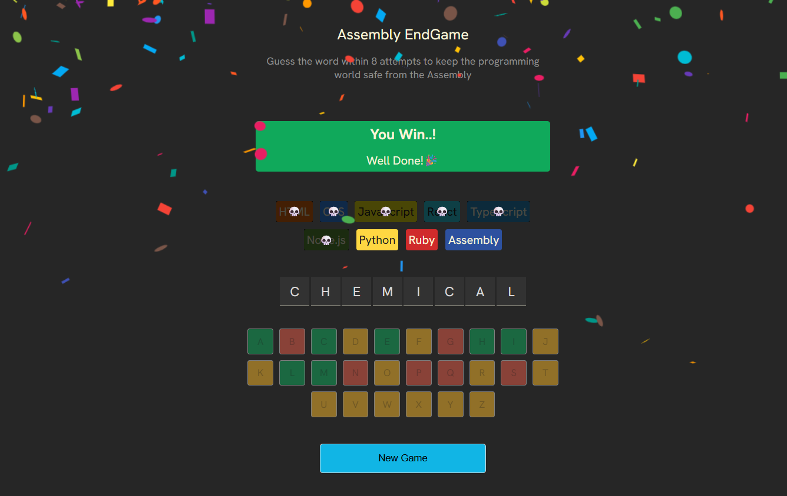

# Assembly EndGame 🎮
A React-based word guessing game inspired by Hangman

Assembly EndGame is an interactive **React-based word guessing game** inspired by Hangman.  
The player must guess a hidden **programming-related word** within a limited number of attempts to win the game and save the programming world from Assembly.

This project focuses on **state-driven UI**, **game logic**, and **user experience**, built using modern React practices.

---

## 🌐 Live Demo
  **Play here**👉 https://assembly-endgame-pravin.netlify.app/

---

## ✨ Features
- Interactive word guessing gameplay
- Limited attempts with win and game-over conditions
- Dynamic on-screen keyboard with real-time visual feedback
- Correct, incorrect, and used letter highlighting
- Restart game functionality
- Confetti animation on successful completion 🎉
- Accessibility support using ARIA roles
- Clean and responsive UI

---

## 🛠 Tech Stack
- **React**
- **JavaScript**
- **Vite**
- **CSS**

---
## ▶️ Run Locally

Follow these steps to run the project on your local machine:

```bash
npm install
npm run dev
```
The application will be available at:
http://localhost:5173

## 🧠 What I Learned
- Managing component state using React hooks
- Using derived state for game logic
- Conditional rendering based on application state
- Handling user interactions efficiently
- Improving user experience with animations and feedback
- Building and deploying a production-ready React application
- Hosting a frontend application using Netlify
---
## 📸 Screenshots

### 🎮 Game Start


### 🕹️ Gameplay


### 🏆 Winning Screen


  
